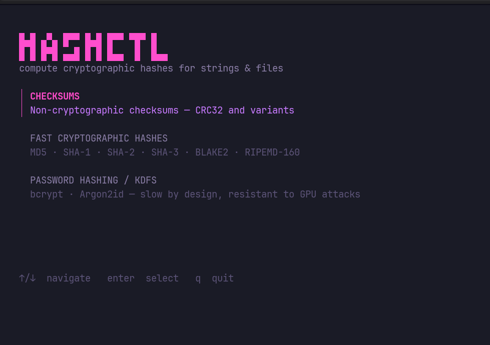

# hashctl ⟡

A terminal UI for computing cryptographic hashes — fast, minimal, keyboard-driven.


---



## Features

- **Fancy list TUI** — powered by [Bubble Tea](https://github.com/charmbracelet/bubbletea) `list` component with live `/` filtering
- **20 + algorithms** — SHA-2, SHA-3, BLAKE2, MD5, RIPEMD-160, bcrypt, Argon2id, CRC32 and more
- **Hash strings or files** — switch modes in one keypress
- **Auto update check** — tells you when a newer version is available on every run
- **Neon magenta / purple theme** — clean hacker-style UI, no boxes, flat layout
- **Released via GoReleaser** — pre-built binaries for Linux, macOS, Windows (amd64 + arm64)

---

## Installation

### Pre-built binary (recommended)

Download the archive for your platform from the [latest release](https://github.com/atharvamhaske/hashctl/releases/latest), extract it, then:

```bash
# Linux / macOS
tar -xzf hashctl-linux-amd64.tar.gz
chmod +x hashctl
sudo mv hashctl /usr/local/bin/hashctl

# Verify
hashctl version
```

### Go install

```bash
go install github.com/atharvamhaske/hashctl@latest
```

### Build from source

```bash
git clone https://github.com/atharvamhaske/hashctl
cd hashctl
go build -o hashctl .
```

---

## Usage

```bash
hashctl          # Launch the interactive TUI
hashctl list     # Print all supported algorithms
hashctl version  # Show version info and check for updates
hashctl check    # Check for a newer release on GitHub
```

### TUI navigation

| Key | Action |
|-----|--------|
| `↑` / `↓` | Move selection |
| `enter` | Confirm / select |
| `/` | Filter algorithms by name |
| `esc` | Go back one screen |
| `s` | Hash a string |
| `f` | Hash a file path |
| `n` | New hash with same algorithm |
| `r` | Restart from category select |
| `q` / `ctrl+c` | Quit |

---

## Available Algorithms

### Checksums (non-cryptographic)
`CRC32`

### Fast Cryptographic Hashes
`MD5` · `SHA-1` · `SHA-224` · `SHA-256` · `SHA-384` · `SHA-512`
`SHA-512/224` · `SHA-512/256`
`SHA3-224` · `SHA3-256` · `SHA3-384` · `SHA3-512`
`RIPEMD-160`
`BLAKE2b-256` · `BLAKE2b-384` · `BLAKE2b-512` · `BLAKE2s-256`

### Password Hashing / KDFs
`bcrypt` · `Argon2id`

---

## Use as a Go library

```go
import "github.com/atharvamhaske/hashctl/internal/hasher"

func main() {
    opts := hasher.DefaultOptions()
    opts.Algorithm = "sha256"

    // Hash a string
    r := hasher.HashString("hello world", opts)
    fmt.Println(r.Hash)

    // Hash a file
    r = hasher.HashFile("/path/to/file.txt", opts)
    fmt.Println(r.Hash)

    // Hash multiple files in parallel (output order preserved)
    hasher.HashFiles([]string{"a.txt", "b.txt"}, opts, func(r hasher.Result) {
        fmt.Printf("%s  %s\n", r.Hash, r.Input)
    })

    // Enumerate algorithms
    for _, name := range hasher.ListNames() {
        alg, _ := hasher.GetAlgorithm(name)
        fmt.Printf("%-20s %s\n", name, alg.Description)
    }
}
```

### API reference

```go
hasher.HashString(input string, opts Options) Result
hasher.HashFile(filename string, opts Options) Result
hasher.HashFiles(files []string, opts Options, onResult func(Result))
hasher.GetAlgorithm(name string) (Algorithm, bool)
hasher.ListNames() []string
hasher.GetAlgorithmsByCategory() map[Category][]Algorithm
```

---

## Built with

- [Bubble Tea](https://github.com/charmbracelet/bubbletea) — TUI framework
- [Bubbles](https://github.com/charmbracelet/bubbles) — `list`, `textinput`, `spinner` components
- [Lip Gloss](https://github.com/charmbracelet/lipgloss) — terminal styling
- [Cobra](https://github.com/spf13/cobra) — CLI commands
- [GoReleaser](https://goreleaser.com) — cross-platform release automation

---

## License

[MIT](LICENSE)
